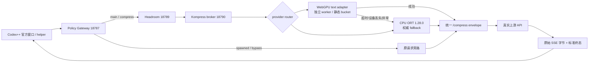

# Headroom for Codex++
# WebGpuExecutionProvider + CPUExecutionProvider 生产部署施工方案

**文档版本**：v1.0
**编制日期**：2026-08-03
**方案状态**：`PLAN_ONLY`，本文件只定义施工、验收和回滚，不代表本轮已经执行生产切换。
**integration_package_id**：`WEBGPU-PROD-DEPLOY-PLAN-20260803/v1`
**目标根目录**：`D:\新建文件夹\headroom for codex++`
**作者**：Codex

---

## 0. 先给结论

当前方案的结论是：**满足条件后可行，当前不可直接切生产**。

生产目标不是“完全依赖 WebGPU”，而是：

```text
main 请求
  -> Headroom/Gateway
  -> WebGPU 文本压缩 worker（首选）
  -> 任意超时、设备丢失、解码异常、worker 崩溃
  -> CPU ORT 压缩/原文 fail-open（权威热备）

spawned 请求
  -> 结构化 metadata 分类
  -> bypass，不进入压缩
```

当前不能直接把 `runtime\lab\webgpu_guard` 接到生产 `/compress`，因为它目前只处理低层 ONNX `feeds`，没有 tokenizer、分词到词的映射、`final_scores -> keep mask`、文本重建、CCR/marker 语义，也没有生产 broker 的 `/compress` HTTP 契约。生产 broker 当前还硬编码只允许 CPU。

本方案要求先完成“文本 adapter + 独立 WebGPU broker + CPU fallback + 完整长流验收”，再进行分阶段流量切换。任何一项闸门为 `UNKNOWN`，都按未通过处理。

---

## 1. 硬边界与不可违反事项

### 1.1 生产红线

以下内容在本方案执行期间不得被修改：

- Codex++ 供应商定义、Base URL、API key、认证、模型、会话和二进制。
- `C:\Users\ma dao\.codex-plus-plus-cli\config.toml`、`C:\Users\ma dao\.codex\config.toml` 的供应商字段。
- Vortex/系统代理、Windows TDR、显示驱动、全局 ONNX Runtime provider、全局 Python/PATH。
- `D:\gpt-image2`。
- 生产桌面任务、防火墙和不属于本次受管链的进程。
- 完整会话正文、令牌、密码、API key、认证数据库和个人数据。

允许的生产改动只有：

1. 受管 Headroom/Kompress 进程级环境变量和 feature flag；
2. 项目根运行状态、脱敏日志和启动收据；
3. 项目内候选文件及其回滚副本；
4. 用户明确确认后的受管进程优雅重启。

### 1.2 当前机器禁止项

当前机器曾出现：

- `0xC0000409`：`CxxThrowException -> onnxruntime_providers_webgpu.dll -> terminate -> abort`。
- `LiveKernelEvent 141`：可读 watchdog 指向 `amdkmdag.sys` GPU engine timeout。
- 动态 cache 反向实验同时触发 native abort 和 141。

因此，在这些故障根因未被独立环境和完整证据覆盖前，不得在当前生产链直接启动 WebGPU session。生产候选必须先在独立机器、可丢弃 Windows 实验环境或明确隔离的硬件环境完成。

---

## 2. 当前事实基线

以下事实来自项目代码、脱敏 evidence 和 2026-08-03 只读侦察；历史收据不得被当成当前运行成功证明。

| 项目 | 当前事实 | 对部署的影响 |
|---|---|---|
| 生产 broker 接口 | `src\kompress_broker\app.py` 提供 `/livez`、`/readyz`、`/health`、`POST /compress` | WebGPU 必须通过 broker/adapter 接入，不能绕过 Headroom |
| 当前 provider | `src\kompress_broker\worker.py` 只允许 CPU，固定 `CPUExecutionProvider` | 必须新增显式 provider router，默认仍为 CPU |
| Headroom 接口 | `HEADROOM_KOMPRESS_ENDPOINT -> /compress`，remote adapter 失败时原文旁路 | 保留 endpoint，不改 Codex++ 供应商配置 |
| WebGPU guard | 一 child、一 bucket、一 session；只返回低层输出 hash/shape | 需要新增文本 adapter，不能直接生产化 |
| 模型输入 | `input_ids:int64[batch,seq]`、`attention_mask:int64[batch,seq]` | tokenizer、shape bucket、padding 必须固定并可复现 |
| 模型输出 | `final_scores:float[batch,seq]` | 必须复现现有 score 阈值、keep/drop、文本重建 |
| 既有 WebGPU 闸门 | seq 128/256/512 各 30 次，keep/drop 100%，p95/CPU 约 0.5165/0.5356/0.7309 | 只证明隔离模型推理，不证明生产压缩或长 SSE |
| containment | EOF/hang/malformed/device loss/native exit 均一次 CPU fallback、熔断、清理 | 可作为 worker 安全边界基础 |
| 生产身份 | `18788` monitor 当前无监听；旧 state/PID/hash 有 stale 风险 | 当前生产切换前置条件不满足 |
| Route C | native egress/官方窗口真实 correlation 未完成，生产保持 off | 不得把 Route C Canary 传输成功当压缩成功 |

### 2.1 当前生产只读阻塞

2026-08-03 侦察发现：

- `18787` Gateway、`18789` Headroom、`18790` broker、`57321` helper、`57865` Manager、`57866` client 有监听；`18788` monitor 无监听。
- `runtime/state` 中部分 PID、timestamp、route watcher 和 monitor 状态与当前运行态不一致。
- `route-state` 的历史 `ready/process` 不能替代新鲜的 listener/path/module/health 身份证据。

**在 monitor 18788 真正监听、`/status` 身份完整、route-state 新鲜且 `allow_relay_pending=false` 之前，不得放行 WebGPU 或自然 SSE。**

---

## 3. 目标架构



### 3.1 组件职责

| 组件 | 生产职责 | WebGPU 施工要求 |
|---|---|---|
| Gateway `18787` | metadata 分类、header 剥离、关联 ID、SSE fail-open | 不改分类契约；spawned 不得误压缩 |
| Headroom `18789` | 策略、缓存、remote compress 调用、SSE 原样透传 | 保持 `HEADROOM_KOMPRESS_ENDPOINT`，不直接导入 WebGPU |
| Kompress broker `18790` | 队列、provider 路由、统一响应、CPU fallback | 新增 WebGPU adapter，但 CPU 为默认和热备 |
| WebGPU parent | 文本 adapter、bucket 调度、worker 生命周期 | 不加载 WebGPU native library |
| WebGPU child | 单 session 推理 | 一 child/一 bucket/一 session；无动态 cache/graph capture |
| CPU worker | 生产 fallback | 与 WebGPU child 进程隔离，保留现有 CPU 参数 |
| Monitor `18788` | 统一状态快照、告警和 feature flag | 必须先恢复新鲜 PID/path/health 证据 |
| route keeper | generation、route-state、配置 hash | 只写 runtime state，不写供应商配置 |

---

## 4. 统一接口契约

### 4.1 broker HTTP 契约

#### `GET /livez`

只表示进程可响应，不表示模型 ready。

#### `GET /readyz`

只有以下条件全部满足才返回 `ready=true`：

- CPU fallback ready；
- WebGPU candidate 若被声明为 enabled，则 canary 已成功；
- tokenizer/model/plugin identity hash 校验通过；
- 当前 bucket policy 合法；
- queue、timeout、worker 状态可读；
- circuit 未因设备丢失打开；
- provider 列表与实际 session 一致。

`deferred`、`unknown`、只完成 import、只完成端口监听，都不能算 ready。

#### `POST /compress`

请求：

```json
{
  "content": "<非敏感文本>",
  "target_ratio": 0.65,
  "request_id": "脱敏关联ID",
  "route_scope": "main"
}
```

约束：

- `content` 必须是字符串；
- `target_ratio` 必须是 `0 < ratio <= 1`；
- 不记录正文；
- 不接受 spawned/bypass 请求；
- 不接受未知 provider 强制切换参数。

成功或 fail-open 都返回统一 envelope，避免 Headroom 因压缩失败收到 5xx：

```json
{
  "compressed": "文本或原文",
  "original_tokens": 0,
  "compressed_tokens": 0,
  "tokens_saved": 0,
  "compression_ratio": 1.0,
  "provider": "webgpu|cpu|passthrough",
  "backend": "onnx_webgpu|onnx_cpu|none",
  "status": "compressed|cpu_fallback|passthrough",
  "fallback": false,
  "fallback_reason": null,
  "latency_ms": 0,
  "request_id": "脱敏关联ID"
}
```

所有异常，包括 timeout、queue full、malformed output、decode error、device removal、worker EOF、native exit，都必须：

1. 记录脱敏 error code；
2. 打开对应 bucket circuit；
3. 有界终止 WebGPU child；
4. 只调用一次 CPU fallback 或直接返回原文；
5. 返回 HTTP 200 passthrough；
6. 不在失效 session 上自动重试；
7. 不制造 Gateway 504。

### 4.2 child JSONL 契约

`ready` 必须包含：

- protocol version；
- provider/backend；
- interpreter/plugin/model version 和 SHA-256；
- 绝对路径（只用于父进程校验，证据中脱敏）；
- bucket、session settings；
- `ORT_SEQUENTIAL`、`mem_pattern=false`、`intra/inter=1`；
- `dynamic_cache=false`、`graph_capture=false`、`parallel_sessions=false`、`batch=1`。

父进程必须重新计算三份文件 hash，不能信任 child 自报值。

`infer` 只接受固定 bucket 的 `feeds`，不允许动态 shape、batch>1 或跨 bucket 复用 session。

### 4.3 请求分类

- `main`：进入 Headroom 压缩策略。
- `spawned`：只有结构化 `x-codex-turn-metadata` 同时证明真实 spawn 和 parent thread 关联时 bypass。
- metadata 损坏、冲突或不足：按 main 处理，不能仅凭 `thread_source=subagent` 判断。
- 内部 route/debug/capability header 在进入上游 helper 前剥离。

---

## 5. 实施工作包

### P0：候选冻结与身份清单

产物：

- `candidate_id=webgpu-cpu-prod-v1`；
- `candidate_kind=complex`；
- `integration_package_id`；
- 版本化 manifest：`version=1`、`algorithm=sha256`、相对路径排序、文件大小、hash、manifest_hash；
- provider/plugin/model/tokenizer/runtime 的版本与 hash；
- 当前 CPU broker、Headroom、Gateway、启动脚本源文件 hash；
- 两份 Codex++ 配置 hash 与 protected supplier contract 摘要。

禁止：

- 把缓存、日志、模型正文、session evidence、认证数据库或密钥放入 candidate；
- 直接以当前工作树替代 `D:\新建文件夹\headroom for codex++` canonical；
- 在 manifest 生成后无记录地重新生成文件。

### P1：文本 WebGPU adapter

这是生产接入的核心施工，不是现有 guard 的简单包装。

必须实现：

1. 复用与 CPU 生产路径相同的 tokenizer 和 normalization；
2. 保持当前 chunk 语义：默认 `chunk_words=350`，少于 10 words 继续 passthrough；
3. 将 token 序列按 128/256/512 静态 bucket padding；
4. 生成 `input_ids` 和 `attention_mask`；
5. 将 `final_scores` 映射回 token/word；
6. 重现 `score > 0.5` keep 语义、target ratio 排序和关键 token 保留；
7. 重现 marker、CCR、代码块、URL、引用、结构化内容的保护规则；
8. 生成与 CPU 路径字节/语义一致的 compressed text；
9. 输出统一 `/compress` envelope；
10. 所有 token 统计保持非负，`tokens_saved` 不得为负数。

必须新增 parity fixtures：

- 普通中文/英文段落；
- 混合中英文、数字、代码、URL、路径；
- markdown 表格、列表、引用、代码块；
- 10 words 边界；
- 128/256/512/513 token 边界；
- 空文本、超长文本、Unicode、非 UTF-8 错误输入；
- ratio=1、ratio 接近 0、非法 ratio。

### P2：broker provider router

当前 worker 只允许 CPU，因此必须新增显式 provider 选择层：

```text
KOMPRESS_PROVIDER_BACKEND=cpu          # 默认、生产热备
KOMPRESS_PROVIDER_BACKEND=webgpu_cpu  # 仅 feature flag 打开后生效
```

实现要求：

- default 必须是 `cpu`；
- `webgpu_cpu` 只启动隔离 WebGPU parent/child；
- CPU worker 和 WebGPU worker 不共享 native session；
- WebGPU worker 不得导入到 broker 主进程；
- provider 路由失败立即回 CPU；
- feature flag 关闭时必须完全不加载 WebGPU 模块；
- `/readyz` 报告真实 provider/backend，不允许只报告配置值；
- `HEADROOM_KOMPRESS_ENDPOINT` 保持不变，Headroom 不需要知道 provider 细节。

### P3：监控与证据

必须新增或统一以下字段：

- `provider`、`backend`、`ready`；
- `route_scope`、`request_class`、`generation`；
- `queue_depth`、`queue_wait_ms`、`inference_ms`、`total_ms`；
- `fallback_count`、`fallback_reason`；
- `worker_restart_count`；
- `device_removal_count`；
- `circuit_open`、`circuit_reason`；
- `requests_compressed`、`requests_passthrough`；
- `tokens_before/after/saved`；
- `sse_completed/failed/disconnected`；
- `official_dataplane=confirmed|bypass|not_proven`。

只保存脱敏 hash、长度、策略、bucket、耗时和 error code，不保存正文。

### P4：启动链与 feature flag

唯一入口仍为：

```text
D:\Desktop\Headroom for Codex++.lnk
  -> wscript.exe Launch-HeadroomForCodexPP.vbs --phase-b
  -> Start-HeadroomWithProgress.ps1
  -> Start-HeadroomForCodexPP.ps1 -Workers 1
```

常规生产启动不得并行点击旧快捷方式，也不得直接启动 Codex++ EXE。

启动前后必须：

- 校验 D 盘源码根和 candidate manifest；
- 校验 Manager/Client 精确 executable path、PID、命令 hash；
- 校验 `18790 -> 18789 -> 18787 -> 18788 -> route-state -> 57321/57865/57866` 顺序；
- 校验 `/livez`、`/health`、`/readyz`、`/status`；
- 校验 `route_scope=process`、`config_mutated=false`；
- 校验 protected supplier contract 不变；
- 校验 monitor 18788 真正监听且状态新鲜；
- feature flag 关闭时证明无 WebGPU/D3D12/AMD 模块加载到生产 Python。

`--phase-b` 涉及 metadata/indicator 变更时必须单独备份、人工确认和单独回滚，不得作为普通生产启动的隐含副作用。

---

## 6. 分阶段落地流程

### G0：冻结与只读前置（当前必须先完成）

**目标**：证明当前生产可被安全观察和回滚。

检查清单：

- [ ] 关闭任何旧直连快捷方式和未授权 owner；不自动接管未知 PID。
- [ ] 记录 D 盘源码 manifest/hash。
- [ ] 记录两个 Codex++ config hash 和 protected supplier contract。
- [ ] 记录 7 个端口 listener、PID、path、command hash、module list。
- [ ] `18788/status` 返回完整 fresh identity，不能是 stale state。
- [ ] route-state generation、owner PID、heartbeat、`allow_relay_pending=false`。
- [ ] `D:\新建文件夹\headroom for codex++\runtime\state` 与当前进程身份一致。
- [ ] 生产 before snapshot `clean=true` 且 `unknown=false`。

任何一项失败：`NO-GO`，不启动 WebGPU。

### G1：独立环境可重复构建

**目标**：在独立机器或可丢弃环境构建，不污染生产。

要求：

- 固定 Python、ORT、WebGPU plugin、numpy、tokenizer、model 和驱动版本；
- 使用项目内 `runtime/lab` cache/wheelhouse；
- 禁止全局 pip、PATH、驱动和 TDR 修改；
- 运行 `py_compile`、单元、静态 validator、manifest validator；
- 生成构建环境收据和所有二进制 hash；
- 构建失败三轮后停止，不换工具链掩盖失败。

### G2：CPU parity 基线

先冻结 CPU 结果，再测 WebGPU：

- 同一 tokenizer、同一输入、同一 ratio、同一 chunk；
- 保存 CPU compressed text 的脱敏 hash、keep mask、关键 token 集合和 token 统计；
- 记录 p50/p95/p99、内存、CPU 占用、队列等待；
- CPU 结果必须成为唯一对照，不以旧历史数字代替当前 candidate 基线。

### G3：WebGPU 低层推理闸门

每个静态 bucket `128/256/512`：

- 至少 30 次完整模型推理；
- `keep/drop >= 99%`；
- 关键 token 保留率 100%；
- 输出 shape、score 容差在测试前冻结；
- p95/WebGPU 与 CPU 比值 `<= 0.8`；
- 无 device removal、Invalid CommandBuffer、native exit、decode error、timeout；
- 一旦设备丢失，立即停止该 bucket，不自动重试。

初始禁止：

- dynamic cache；
- graph capture；
- parallel sessions；
- batch>1；
- 动态 bucket 切换；
- 关闭 CPU fallback。

### G4：文本 adapter parity 闸门

必须同时通过：

- CPU/WebGPU tokenization 一致；
- word/token offset 一致；
- keep mask 一致率 >=99%；
- 关键 token 100% 保留；
- marker/CCR/代码/URL/引用保持一致；
- `target_ratio` 误差在预先冻结容差内；
- 文本重建不改变不可压缩区域；
- 空、短、超长、Unicode 和 malformed input 均 fail-open；
- adapter 失败不影响 CPU broker。

### G5：隔离 broker 联测

在独立端口运行“fake upstream + Gateway + Headroom + broker + WebGPU adapter”：

- 真实调用 `/compress`，不能只看 `main/compress` 标签；
- `requests_compressed > 0`；
- broker `total/compressed/fallback` 计数与 request correlation 一致；
- main 进入压缩；spawned 旁路；
- 长 SSE 每条都有 `response.completed` 或标准 `response.failed`；
- 压缩失败返回原文 HTTP 200；
- 不得有静默断流、重复非幂等请求或 504。

### G6：故障注入闸门

逐项独立注入：

| 故障 | 必须观察到 |
|---|---|
| queue full | 原文/CPU fallback，HTTP 200，无重试风暴 |
| inference timeout | child 清理、breaker open、CPU fallback 一次 |
| worker EOF | 同上 |
| malformed JSON | 不污染 SSE，不暴露正文 |
| decode error | fail-open，不产生 504 |
| device lost / `0x887A0005/06/07/20` | 销毁 WebGPU session，切 CPU |
| native `0xC0000409` | 父进程存活，child tree 清理，手动熔断 |
| LiveKernelEvent 141 | 立即停用硬件 candidate，保留诊断收据 |
| upstream EOF 无终态 | 追加一次 `response.failed` |
| helper read timeout | 不盲目重放非幂等 POST |

每类故障必须恰好一次 CPU fallback；不得在失效 session 上自动重试。

### G7：生产 shadow（不改变用户结果）

只有 G0-G6 全通过后：

- WebGPU 接收复制请求或脱敏 fixture，不改变实际响应；
- CPU 结果仍返回给用户；
- 记录 WebGPU/CPU 输出 hash、延迟和差异；
- shadow 窗口至少覆盖不同长度、不同 ratio、main/spawned、长流和重启；
- 任何生产 snapshot UNKNOWN/drift 立即停止 shadow。

### G8：小流量 canary

建议流量顺序：`1% -> 5% -> 10% -> 25% -> 50% -> 100%`。

每一阶段必须满足：

- 连续观察窗口内压缩引起的 504=0；
- SSE 静默断流=0；
- 缺少终态=0；
- spawned 误压缩=0；
- WebGPU fallback 可用；
- CPU fallback 延迟不超过冻结预算；
- device removal、native crash、141=0；
- before/after snapshot clean 且无 config hash drift。

任何一个阶段失败，立即回到 CPU，不能跳过阶段。

### G9：正式放量与 24 小时观察

正式放量后仍保留 CPU 热备和人工 reset breaker：

- 至少 24 小时自然样本；
- 至少 50 main + 50 spawned 真实 SSE；
- 供应商切换后仍读取最新 SettingsStore，不修改供应商配置；
- Manager/Client 重启后 route generation 正确刷新；
- 登录/注销、桌面重启和异常退出后能安全回滚；
- 监控和告警无 stale state。

---

## 7. Provider 与资源参数

### 7.1 WebGPU child 初始参数

```text
graph_optimization_level = ORT_ENABLE_ALL
execution_mode           = ORT_SEQUENTIAL
enable_mem_pattern       = false
intra_op_num_threads     = 1
inter_op_num_threads     = 1
batch                    = 1
seq buckets              = 128, 256, 512
dynamic_cache            = false
graph_capture            = false
parallel_sessions        = false
```

### 7.2 队列和超时

初始不启用 micro-batching。参数按 CPU 基线和 G3/G5 实测冻结：

- queue wait：必须有界，建议先设为 250ms 以内；
- WebGPU 单请求预算：不得超过总 broker deadline；
- broker 总 deadline：继承当前 20s 上限，不能因 WebGPU 无限延长；
- queue limit：先使用单 worker 的小上限，满载立即 CPU fallback；
- worker startup：必须在 readiness 窗口内完成真实 canary；
- cancel：上游取消必须传递给等待队列和 child 清理。

不得凭经验把 `workers=2`、线程数或队列上限固定为生产值；每个值必须有 p95、吞吐、内存和 fallback 证据。

### 7.3 CPU fallback 参数

CPU 继续使用经过生产验证的 ORT `1.28.0` 配置和独立 worker。WebGPU child 不得与 CPU worker 共享 native session、线程池或 device context。

---

## 8. 生产启动施工顺序

以下是执行时的顺序，不是本轮执行记录。

### 8.1 启动前

> `Validate-ProductionCandidate.ps1` 是本方案要求新增的只读 validator；当前目录尚不存在该脚本。实现和独立验收完成前，不得把下面命令当作已经可执行的生产命令。

```powershell
pwsh -NoProfile -ExecutionPolicy Bypass -File "D:\新建文件夹\headroom for codex++\scripts\Validate-ProductionCandidate.ps1" -Mode ReadOnly
```

必须保存：

- candidate manifest hash；
- 7 个端口 listener identity；
- 当前进程 executable path/hash/module list；
- 两份 Codex++ config hash；
- protected supplier contract；
- 当前 route-state、generation、owner PID、heartbeat；
- `/livez`、`/health`、`/readyz`、`/status` 快照。

### 8.2 唯一启动入口

只允许用户双击：

```text
D:\Desktop\Headroom for Codex++.lnk
```

该快捷方式通过 `wscript.exe` 调用项目根 VBS，使用 UAC `runas`，再按 broker -> Headroom -> Gateway -> monitor -> route-state -> Manager -> client 顺序启动。

不要：

- 直接双击 Codex++ EXE；
- 并行点击旧快捷方式；
- 把 `http://127.0.0.1:18787/v1` 写回供应商页面；
- 在 monitor/route-state 未 ready 时放行客户端；
- 使用旧的 stale `runtime/state` 作为当前成功证据。

### 8.3 启动后

```powershell
pwsh -NoProfile -ExecutionPolicy Bypass -File "D:\新建文件夹\headroom for codex++\scripts\Validate-ProductionCandidate.ps1" -Mode ReadOnly -AfterStart
```

只有以下全部通过才允许用户发送自然请求：

- broker `/readyz=200` 且 backend/provider 与实际 session 一致；
- Headroom/Gateway `/livez` 和 `/health=200`；
- monitor `18788/status=200` 且 PID/path/hash fresh；
- route-state `ready`、`route_scope=process`、`config_mutated=false`、`allow_relay_pending=false`；
- Manager/Client exact path/PID；
- protected supplier contract 前后 hash 不变；
- WebGPU feature flag 与 candidate manifest 一致；
- 最小 main 和 spawned SSE 都有标准终态；
- 生产进程没有未知 WebGPU/D3D12/AMD 模块。

---

## 9. 回滚施工方案

### 9.1 立即回滚触发条件

任一条件发生，立即停止 WebGPU 接流：

- snapshot `unknown=true` 或 `drift=true`；
- monitor 缺失、状态 stale 或 `overall=red`；
- 任意配置 hash/protected supplier contract 漂移；
- `0xC0000409`、141、device lost、Invalid CommandBuffer/Encoder；
- WebGPU timeout、EOF、malformed output、decode error；
- fallback 次数异常、CPU fallback 失败、重试计数大于 0；
- 504、静默断流、缺少 SSE 终态、spawned 误压缩；
- 真实 broker 计数为零但策略标签显示 main/compress；
- 发现 WebGPU 模块进入不应加载的生产进程。

### 9.2 回滚动作

1. feature flag 切回 `cpu`；
2. 停止 WebGPU 新请求，不再接受新 bucket；
3. 对已确认的 WebGPU child 执行 terminate，超时再 kill tree；
4. 打开 manual-reset circuit，不自动重启失效 worker；
5. CPU broker 继续服务，失败时原文 fail-open；
6. 重新抓 before/after production snapshot；
7. 保留 crash dump、CDB/WER metadata、worker error code 和 correlation receipt；
8. 确认生产 Python 没有加载 WebGPU/D3D12/AMD 模块；
9. 确认 Config hash/protected supplier contract 未变；
10. 只有所有身份重新 clean 且负责人批准，才可恢复 CPU 正常服务；
11. WebGPU 重新启用必须创建新 candidate/version，不得在旧熔断状态上自动复活。

### 9.3 回滚禁止事项

- 不修改驱动、TDR、全局 provider；
- 不重写 config.toml、Base URL、API key、认证或模型；
- 不停止未知 PID 或未知端口 owner；
- 不使用 `git reset --hard`、`git clean` 或强制推送；
- 不删除诊断证据后声称故障消失。

---

## 10. 监控与告警

### 10.1 必须持续监控

| 指标 | 绿色条件 | 立即停止条件 |
|---|---|---|
| `webgpu_ready` | true 且 identity fresh | false/deferred/unknown |
| `cpu_ready` | true | false |
| `queue_depth` | 在冻结上限内 | queue full 连续出现 |
| `webgpu_latency_p95` | 不劣于 candidate 门槛 | 超过 CPU 对照或总 deadline |
| `fallback_rate` | 仅故障注入或低比例 | 持续升高/CPU失败 |
| `device_removal` | 0 | 任意一次生产设备移除 |
| `worker_restart` | 0 | 任意自动重启 |
| `sse_disconnected` | 0 | 任意静默断流 |
| `response_completed/failed` | 100% 有终态 | 缺终态 |
| `spawned_compressed` | 0 | 大于 0 |
| `config_mutated` | false | true 或 unknown |
| `official_dataplane` | confirmed | bypass/not_proven |

### 10.2 日志脱敏

允许：request_id hash、content length、token count、bucket、ratio、provider、backend、latency、error code、PID、source hash。
禁止：正文、token、API key、authorization header、cookie、完整上游响应、session body。

---

## 11. 最终验收矩阵

### 11.1 单元与静态

- [ ] metadata main/spawned 分类；
- [ ] 损坏/冲突 metadata；
- [ ] header stripping；
- [ ] token 矛盾数据；
- [ ] ratio/空/短/Unicode/malformed input；
- [ ] child hash/path identity；
- [ ] provider disabled 时无 WebGPU import；
- [ ] manifest、编码、LF、secret scan；
- [ ] `validator` 退出码 `0=pass`、`1=drift/unknown`、`2=malformed/untrusted`。

### 11.2 集成

- [ ] broker `/compress` 真实调用；
- [ ] `requests_compressed > 0`；
- [ ] main 压缩、spawned bypass；
- [ ] CPU fallback；
- [ ] 长 SSE 标准终态；
- [ ] Manager/Client 重启和供应商切换不改 protected contract；
- [ ] Headroom/Gateway/monitor/route-state 同一 generation。

### 11.3 故障注入

- [ ] queue full；
- [ ] timeout；
- [ ] worker crash/EOF；
- [ ] malformed JSON；
- [ ] decode error；
- [ ] device removal；
- [ ] native `0xC0000409`；
- [ ] upstream EOF；
- [ ] non-UTF8 error；
- [ ] 504 防护；
- [ ] 无 retry storm；
- [ ] child tree 完整清理。

### 11.4 真实流量

- [ ] 至少 50 个 main SSE；
- [ ] 至少 50 个 spawned SSE；
- [ ] 504=0；
- [ ] 5xx=0；
- [ ] 静默断流=0；
- [ ] 缺少终态=0；
- [ ] decode/transport interruption=0；
- [ ] spawned 误压缩=0；
- [ ] main 真实 broker 压缩计数大于 0；
- [ ] CPU fallback 可用；
- [ ] 24 小时自然样本无设备/原生崩溃。

### 11.5 独立验收

验收员不得参与主要施工。独立验收必须读取：

- candidate manifest 和 manifest hash；
- before/after production snapshot；
- provider/plugin/model/interpreter identity；
- broker counters；
- SSE correlation；
- config hash/protected supplier contract；
- failure injection receipt；
- rollback receipt；
- 当前端口/PID/path/module 实时证据。

没有可读独立收据，不得报告完成。

---

## 12. 当前 Go / No-Go 判断

### 当前结论：`NO-GO`

原因：

1. 生产 monitor `18788` 当前无监听；
2. 当前 state/PID/hash 存在 stale/UNKNOWN；
3. 当前 broker worker 只允许 CPU；
4. WebGPU guard 尚未实现文本 adapter；
5. 未完成真实 WebGPU `/compress` 与长 SSE 联测；
6. 现有 Route C Canary 的成功传输没有非零 Kompress 计数；
7. 当前机器有 0409/141 历史风险，根因尚未解除；
8. 官方窗口全链 correlation、供应商切换、回滚和 24 小时自然样本未完成。

### 允许进入下一阶段的条件

只有当 G0-G6 全部 `SUCCEEDED`，且独立环境完成真实压缩和流式验收，才允许 G7 shadow。
只有 G7 shadow、人工确认和独立验收全部通过，才允许 G8 1% canary。
只有所有 canary 阶段无触发条件，才允许扩大流量。

---

## 13. 证据索引

代码与接口：

- `src/kompress_broker/app.py`
- `src/kompress_broker/worker.py`
- `src/kompress_broker/kompress_compressor.py`
- `src/headroom/site-packages-patches/headroom/transforms/content_router.py`
- `src/headroom/site-packages-patches/headroom/kompress_remote.py`
- `runtime/lab/webgpu_guard/worker.py`
- `runtime/lab/webgpu_guard/orchestrator.py`
- `runtime/lab/webgpu_guard/policy.py`
- `runtime/lab/webgpu_text_adapter/webgpu_provider.py`（隔离工作树）
- `runtime/lab/webgpu_text_broker/worker.py`（隔离工作树）
- `runtime/lab/webgpu_text_broker/broker.py`（隔离工作树）
- `runtime/lab/guard/production_validator.py`（隔离工作树）

关键 evidence：

- `evidence/accel-webgpu-risk-containment-v1.json`
- `evidence/accel-webgpu-risk-guard-v1.json`
- `evidence/accel-webgpu-gates-summary-v1.json`
- `evidence/accel-webgpu-concurrency-v1.json`
- `evidence/accel-webgpu-full-only-recheck-v1.json`
- `evidence/accel-webgpu-dynamic-cache-reverse-crash-v1.json`
- `evidence/crash-root-cause-readonly-20260802.json`
- `evidence/route-c-independent-audit-20260803.json`
- `evidence/reasonix-completion-audit-20260803.json`
- `evidence/accel-webgpu-text-router-v1.json`（隔离文本 provider/router，`passed_lab_only`）
- `evidence/production-candidate-audit-20260804.json`（生产只读快照，`NO-GO`）
- `evidence/accel-webgpu-stability-preflight-v1.json`（硬件风险 fail-closed，`passed_lab_only`）

启动与状态：

- `scripts/Launch-HeadroomForCodexPP.vbs`
- `scripts/Start-HeadroomWithProgress.ps1`
- `scripts/Start-HeadroomForCodexPP.ps1`
- `runtime/state/route-state.json`
- `runtime/state/headroom-start-result.json`
- `runtime/state/kompress-broker-runtime.json`
- `scripts/Validate-ProductionCandidate.ps1`
- `experiments/accelerators/webgpu/run_text_acceptance.py`（独立环境真实验收 harness）

---

## 14. 执行前签字表

| 项目 | 负责人 | 状态 |
|---|---|---|
| 独立环境可重复构建 |  | `PENDING` |
| 文本 adapter parity |  | `PENDING` |
| WebGPU 低层 30x bucket 闸门 |  | `PENDING` |
| broker `/compress` 真实计数 |  | `PENDING` |
| 长 SSE 与故障注入 |  | `PENDING` |
| production snapshot clean |  | `PENDING` |
| shadow 观察 |  | `PENDING` |
| canary 放量 |  | `PENDING` |
| 独立验收 |  | `PENDING` |
| 回滚演练 |  | `PENDING` |

**批准生产切换前必须由用户确认**：目标机器/隔离环境、维护窗口、feature flag、首阶段流量、回滚责任人和是否允许人工重启受管 Manager/Client。

**本文件作者结论**：当前方案“满足条件后可行”，但当前生产状态仍为 `NO-GO`；CPU ORT 继续作为生产权威后端。

---

## 15. 2026-08-04 复核与施工更正（v1.1）

### 本轮结论

当前组合 **`WebGpuExecutionProvider + CPUExecutionProvider` 仍不满足生产部署条件，结论为 `NO-GO`**。本轮没有启动当前机器的 WebGPU/DirectML/NPU/MIGraphX 硬件 session，也没有修改生产 `src/kompress_broker`、启动链、Codex++ 配置、供应商、Base URL、认证、模型、会话、驱动/TDR 或 `D:\gpt-image2`。

生产只读收据 `evidence/production-candidate-audit-20260804.json`（SHA-256 `ACB0A159C6433CED4AB37D53FB384020996B90D11BFA47BDB935A5888CE2409D`）显示：

- `18788` monitor 没有监听；
- PowerShell 完整 PID/路径/模块采集超时，回退 `netstat`，因此生产身份为 `UNKNOWN`，不是 clean；
- route-state heartbeat 已过期；
- `18787` Gateway、`18789` Headroom、`18790` Kompress 当前健康探针可达，Kompress 实际为 `CPUExecutionProvider/onnx/ready`，但不能抵消前述门禁失败。

### 已完成的隔离施工

以下改动只存在于 `runtime/lab`，默认路径仍为 CPU：

1. `runtime/lab/webgpu_guard/worker.py` 增加显式 `return_scores=true`/`output_name=final_scores` 协议；默认仍只回传 hash/shape，分数输出上限 4096 且做有限数校验。
2. 新增 `runtime/lab/webgpu_text_adapter/webgpu_provider.py`，把 guard JSONL 映射为文本 adapter 的 `ProviderOutput`；任何 guard fallback、device loss、EOF、malformed output 都转换为 `ProviderFailure`，由 CPU adapter 接管。
3. `runtime/lab/webgpu_text_broker/worker.py` 增加显式 provider router：`cpu`（默认）和 `webgpu_cpu`（实验 flag）。WebGPU 初始化失败时保持 CPU worker ready，并在无正文的 readiness metadata 中报告 `cpu_fallback`。
4. `runtime/lab/webgpu_text_broker/broker.py` 增加实际后端、`official_dataplane`、fallback reason 和 provider flag 状态；`HEADROOM_KOMPRESS_ENDPOINT` 契约不变。
5. 新增只读验证器 `scripts/Validate-ProductionCandidate.ps1` 与 `runtime/lab/guard/production_validator.py`：退出码 `0=GO`、`1=drift/unknown/NO-GO`、`2=malformed/unreadable`；增加 route heartbeat 新鲜度和 `.codex-plus-plus-cli/config.toml` 哈希检查。

### 可复核测试

- 加速测试：`28` 个，`27` 通过，`1` 个因隔离环境缺少 `tokenizers` 依赖按门禁跳过；
- WebGPU guard：`12/12` 通过；公共 guard：`11/11` 通过；
- `compileall`、`git diff --check`：通过；
- CPU lab broker HTTP/真实 ORT 回归：通过，默认 provider 为 `CPUExecutionProvider`、`official_dataplane=confirmed`；
- 汇总证据：`evidence/accel-webgpu-text-router-v1.json`，状态 `passed_lab_only`，不是生产放行收据。

### 对原计划的修订

- 原第 12 节“broker worker 只允许 CPU、guard 尚无文本 adapter”两项已改为：**隔离文本协议和 provider router 已完成，生产 broker 仍保持 CPU-only**；
- 原 G4/G5/G6/G7 门槛不降低，必须在独立机器或可丢弃 GPU 环境用真实 WebGPU provider 完成完整模型文本 `/compress`、动态长度、故障注入和长 SSE；
- 当前机器已有 `0xC0000409` 与 `LiveKernelEvent 141` 证据，禁止在该机重新启动硬件 session；
- `official_dataplane=confirmed` 只有真实 WebGPU session 完整握手、输出 parity 和硬件稳定性闸门通过后才可用于 WebGPU canary；CPU fallback 的 `confirmed` 不能冒充 WebGPU 成功；
- 生产 monitor/route-state 必须先由唯一启动入口恢复为 fresh clean，再进入 G0；不能使用本次 stale/UNKNOWN 收据代替。

### 下一阶段放行条件（未完成）

1. 独立环境完成 WebGPU plugin、解释器、模型和驱动 manifest/hash；
2. 真实文本 adapter parity（tokenizer、offset、keep/drop、CCR、关键 token）通过；
3. `128/256/512` 三个 bucket 各 30 次完整模型推理，无 device removal、0409、141、decode error 或超时，且 p95 不劣于冻结的 CPU 门槛；
4. 隔离 broker 完成长 SSE、queue full、timeout、EOF、malformed、device loss 和 CPU fallback；
5. 生产 G0 snapshot `clean=true`、`unknown=false`，18788 fresh，route heartbeat 新鲜，配置/供应商 contract 前后 hash 不变；
6. 未参与施工的验收员出具独立收据，随后才允许 shadow/canary；最后还需 50+50 真实 SSE 与 24 小时自然样本。

**作者：Codex。状态：隔离施工部分完成；生产部署条件未满足，CPU ORT 继续为生产后端。**

---

## 16. 2026-08-04 GPU 稳定性修复与真实验收闸门

### 风险修复

- 新增 `runtime/lab/webgpu_guard/safety.py` 硬件 preflight：没有显式独立环境标记，或项目存在既有 0409/141 crash 收据时，在任何 native provider import/session 创建前拒绝启动。
- `runtime/lab/webgpu_guard/worker.py` 直接启动也执行同一 preflight，不能绕过文本 broker 的安全门。
- 新增 `experiments/accelerators/webgpu/run_text_acceptance.py`：独立环境运行 128/256/512 bucket 的真实 CPU/WebGPU 文本压缩对照，只保存 hash、计数、延迟和 fallback，不保存正文。

### 当前验证结果

- 当前项目直接运行真实验收 harness：`status=blocked`、`error_code=known_crash_evidence_blocks_hardware`、`hardware_session_started=false`。
- 直接运行 WebGPU guard：同样在 native 初始化前返回 `known_crash_evidence_blocks_hardware`。
- 收据：`evidence/accel-webgpu-stability-preflight-v1.json`，状态 `passed_lab_only`；这证明风险门生效，不是 WebGPU 推理成功。
- 测试：WebGPU guard `14/14`；主解释器加速套件 `30`（`29` passed、`1` skipped），隔离 lab venv `33/33` passed；compileall 和 diff-check 通过。

### 独立环境真实验收命令

仅允许在没有本项目 0409/141 收据的独立 GPU 环境执行，并使用隔离解释器：

```powershell
$env:WEBGPU_GUARD_ALLOW_HARDWARE = '1'
$env:WEBGPU_GUARD_INDEPENDENT_ENV = '1'
& .\runtime\lab\webgpu\.venv\Scripts\python.exe experiments/accelerators/webgpu/run_text_acceptance.py `
  --project-root . --runs-per-bucket 30
```

若出现任意 device loss、`0xC0000409`、141、decode error、timeout、fallback 或 compressed hash/parity 不满足门槛，必须停止该环境并保留收据；不得在同一失效 session 上重试。

**修订结论：当前机器的稳定性风险已被 fail-closed 隔离，但真实 WebGPU 文本验收仍未执行；生产仍为 CPU ORT，状态继续 `NO-GO`。**

作者：Codex。
